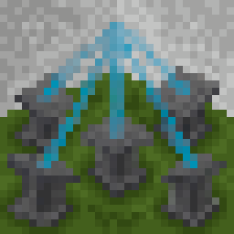

# Wandering Wizardry

    

A Minecraft mod expanding the scope of sculk, while retaining a vanilla feeling.

## Contributing
If you're contributing translations or tags, make sure to use the `data` directory.

Data there is converted from [FennecConfig](https://github.com/Oliver-makes-code/FennecConfig) to JSON at compiletime.

## Building the mod
To build the mod, you need a JDK >= 17, as well as [Deno](https://deno.com/runtime)

Everything should be done using the `./gradlew build` command.
