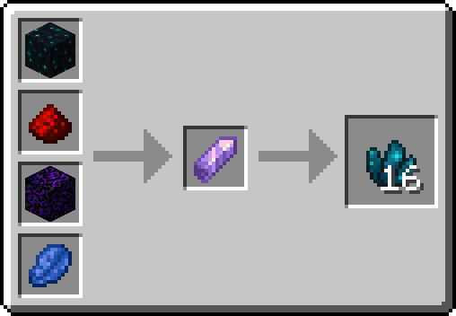
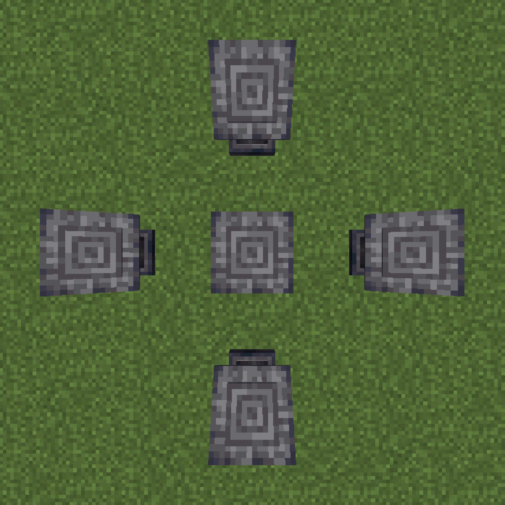

# Introduction
todo!

## Understanding Recipes

This is the recipe for Crystalline Sculk.
It is composed of three main parts, the Ingredients, the Catalyst, and the Output

The catalyst acts as the main ingredient of a recipe, and is placed in the center,
while the other ingredients are placed on the outside

